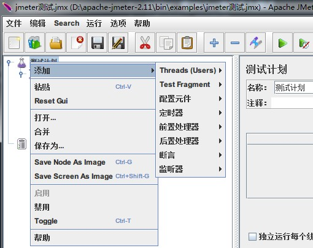
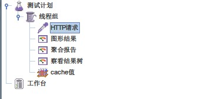
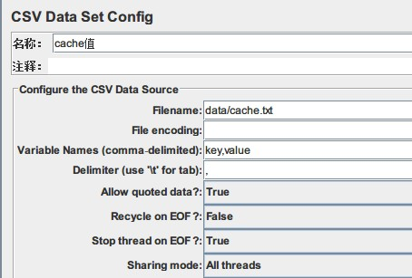

JMeter既有windows下的图形界面，也可以在linux下命令行使用。

### JMeter启动  

 * windows  
>进入bin目录，双击jmeter.bat即可以启动JMeter  

 * linux
>同样进入bin目录，运行jmeter.sh应该就能启动了（没有使用过）

### JMeter的几个概念

 * 测试计划，相当于一个或者一组测试用例
 * 线程组，一个测试计划需要一个或多个线程组，线程组设置线程属性，包括线程数量、循环次数和启动时间等等
 * Sampler，用于向测试对象发送请求，比如HTTP请求，FTP请求等等
 * 配置元件，用来修改或者设置请求数据，比如HTTP信息头管理器就用于发送http请求时，请求头内容的设置，我用到另外一个就是CSV Data Set Config，用于请求数据参数化。
 * 断言，用于请求结果判断
 * 监听器，可以查看请求结果，如果是压力测试，还能看到一些性能指标。

### JMeter使用（windows下）

 * 双击启动JMeter后，右键单击`测试计划`，添加一个线程组  

  

 * 我需要压力测试后端服务器的性能，所以在添加的线程组下，添加一个Sampler，HTTP请求，然后再添加一些监控器，查看测试结果，最后我的测试用例结构如图

  

 * 添加Sampler之后，需要设置请求的数据，由于我需要测试服务器的缓存性能，所以需要很多key-value值，JMeter提供了请求数据参数化的功能，我用CSV Data Set Config这个配置元件

  

在运行这个测试用例之前，JMeter会提示保存本次测试，所以我将jmx文件保存在bin/examples，JMeter在加载CSV文件时，会从当前目录查找，所以我第一次设置`Filename`为`examples/data/cache.txt`时，会找不到该文件，后来设置为`data/cache.txt`则能正常加载。

CSV Data Set Config配置时有几个比较难理解的选项

 * Variable Names(comma-delimited)，定义变量名，与CSV文件每行的数据一一对应，比如我这里定义的是`key,value`，那么在cache.txt文件中  

 >0,fas

 这里key的值为0，value的值为fas，这就是JMeter参数化的方法之一，在需要用到的地方，比如HTTP请求设置请求数据时，就可以这样引用cache.txt的值  

 ~~~~
 ${key}  
 ${value}
 ~~~~

 * Delimiter，定义在CSV文件中，各个字段的分隔符
