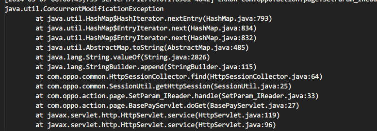
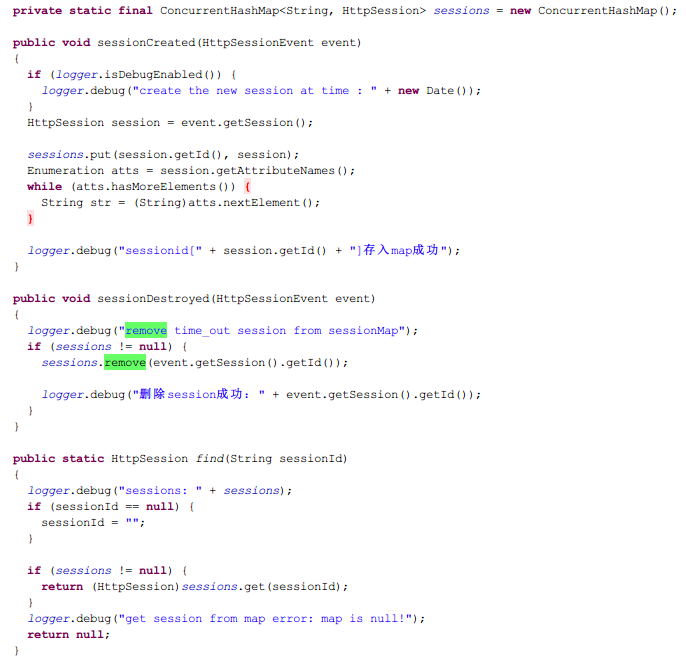

前段时间，支付服务器出现`java.util.ConcurrentModificationException`异常，是HashMap使用不当导致的，现在将onenote上的日志整理发到博客上。

### 异常分析  

 * 异常描述  
服务器具体的异常栈信息如下：  

  

其实从异常栈信息，就很明显看到原因了，但是还是有必要根据HashMap的源码分析一次原因，加深印象。接下来，看看修复之后的部分源码 :   

ps : 这是修改之后的代码，修改前 sessions为普通的Map，即HashMap。  

绿框中的代码是关键部分，从日志来看，报错是在log4j debug方法上：  

~~~~  
logger.debug("session: " + sessions);  
~~~~  

 * HashMap源码分析  
从异常栈信息来看，sessions的toString方法被调用，从此入手，HashMap继承了AbstractMap，toString方法是AbstractMap实现的：  

~~~~  
    public String toString() {
	Iterator<Entry<K,V>> i = entrySet().iterator();
	if (! i.hasNext())
	    return "{}";

	StringBuilder sb = new StringBuilder();
	sb.append('{');
	for (;;) {
	    Entry<K,V> e = i.next();
	    K key = e.getKey();
	    V value = e.getValue();
	    sb.append(key   == this ? "(this Map)" : key);
	    sb.append('=');
	    sb.append(value == this ? "(this Map)" : value);
	    if (! i.hasNext())
		return sb.append('}').toString();
	    sb.append(", ");
	}
    }  
~~~~  

首先获取了iterator：  

~~~~   
    public Set<Map.Entry<K,V>> entrySet() {
	return entrySet0();
    }

    private Set<Map.Entry<K,V>> entrySet0() {
        Set<Map.Entry<K,V>> es = entrySet;
        return es != null ? es : (entrySet = new EntrySet());
    }

    private final class EntrySet extends AbstractSet<Map.Entry<K,V>> {
        public Iterator<Map.Entry<K,V>> iterator() {
            return newEntryIterator();
        }
        public boolean contains(Object o) {
            if (!(o instanceof Map.Entry))
                return false;
            Map.Entry<K,V> e = (Map.Entry<K,V>) o;
            Entry<K,V> candidate = getEntry(e.getKey());
            return candidate != null && candidate.equals(e);
        }
        public boolean remove(Object o) {
            return removeMapping(o) != null;
        }
        public int size() {
            return size;
        }
        public void clear() {
            HashMap.this.clear();
        }
    }  
~~~~  

调用entrySet，返回EntrySet，然后调用它的iterator()方法，返回迭代器：  

~~~~  
    Iterator<Map.Entry<K,V>> newEntryIterator()   {
        return new EntryIterator();
    }  
~~~~

从这里可以看出，每次调用iterator()方法，都会返回一个新的迭代器。再来看看EntryIterator迭代器的实现：  

~~~~  
    private final class EntryIterator extends HashIterator<Map.Entry<K,V>> {
        public Map.Entry<K,V> next() {
            return nextEntry();
        }
    }  
~~~~  

EntryIterator继承于HashIterator，实现了next()方法，也就是说，当调用HashMap的toString方法时，迭代器的next方法是这个。ok，继续看next()方法，调用了nextEntry() ：  

~~~~  
        final Entry<K,V> nextEntry() {
            if (modCount != expectedModCount)
                throw new ConcurrentModificationException();
            Entry<K,V> e = next;
            if (e == null)
                throw new NoSuchElementException();

            if ((next = e.next) == null) {
                Entry[] t = table;
                while (index < t.length && (next = t[index++]) == null)
                    ;
            }
	    current = e;
            return e;
        }  
~~~~  

终于找到了ConcurrentModificationException异常，源码暂且分析到这里，先来看看一个示例。

 * 示例分析

~~~~  
public class TestMap {

	public static void main(String[] args) {
		Map<String, String> map = new HashMap<String, String>();
		
		map.put("key", "value");
		map.put("key1", "values");
		
		Iterator<Map.Entry<String, String>> iterator = map.entrySet().iterator();
		System.out.println(iterator);
		map.remove("key");
//		iterator = map.entrySet().iterator();
//		System.out.println(iterator);
		if (iterator.hasNext()) {
			System.out.println(iterator.next().getKey());
		}
	}
}  
~~~~

先把24行和25行注释掉，运行这段代码：  

~~~~  
Exception in thread "main" java.util.ConcurrentModificationException
java.util.HashMap$EntryIterator@3d4b7453
	at java.util.HashMap$HashIterator.nextEntry(HashMap.java:793)
	at java.util.HashMap$EntryIterator.next(HashMap.java:834)
	at java.util.HashMap$EntryIterator.next(HashMap.java:832)
	at com.demo.map.TestMap.main(TestMap.java:27)
~~~~

然后把24行和25行打开：  

~~~~
java.util.HashMap$EntryIterator@41d5550d
java.util.HashMap$EntryIterator@1cc2ea3f
key1  
~~~~  

一切正常。
问题出在remove上：

~~~~  
   public V remove(Object key) {
        Entry<K,V> e = removeEntryForKey(key);
        return (e == null ? null : e.value);
    }

    /**
     * Removes and returns the entry associated with the specified key
     * in the HashMap.  Returns null if the HashMap contains no mapping
     * for this key.
     */
    final Entry<K,V> removeEntryForKey(Object key) {
        int hash = (key == null) ? 0 : hash(key.hashCode());
        int i = indexFor(hash, table.length);
        Entry<K,V> prev = table[i];
        Entry<K,V> e = prev;

        while (e != null) {
            Entry<K,V> next = e.next;
            Object k;
            if (e.hash == hash &&
                ((k = e.key) == key || (key != null && key.equals(k)))) {
                modCount++;
                size--;
                if (prev == e)
                    table[i] = next;
                else
                    prev.next = next;
                e.recordRemoval(this);
                return e;
            }
            prev = e;
            e = next;
        }

        return e;
    }  
~~~~

直接调用remove，会使得modCount++，而modCount的作用，可以参考javadoc:

~~~~  

    /**
     * The number of times this HashMap has been structurally modified
     * Structural modifications are those that change the number of mappings in
     * the HashMap or otherwise modify its internal structure (e.g.,
     * rehash).  This field is used to make iterators on Collection-views of
     * the HashMap fail-fast.  (See ConcurrentModificationException).
     */
    transient volatile int modCount; 
 
~~~~

 * 结论

看完示例代码，再回到next()方法，可以看到HashMap的remove方法，并没有修改expectedModCount（该变量是调用HashIterator构造函数时，被设置为modCount的），从而导致异常发生。
再回来看看线上代码，一个线程会调用log.debug()方法，进入Map的toString()方法，会生成新的Iterator对象，进而调用next()方法，如果此时另外有线程sessionDestoryed()方法，而sessions又是类成员，调用HashMap的remore方法，异常就这样爆出来了。

### 扩展

 * 整个过程分析下来，对HashMap的结构有了更深的了解，从往上找来一张HashMap的结构图，加深印象：  

 * HashMap在并发环境下使用，其实还有另外一种更严重的坑，会导致CPU飙升，具体可以看看耗子叔的[酷壳](http://coolshell.cn/articles/9606.html)， 然后，就在前几天，线上居然真的发现CPU飙升的代码，真的是无处不在的坑啊。

